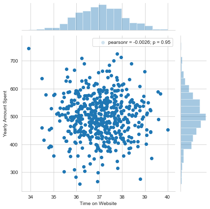

# Linear Regression (Practice Project)

## Overview

* This analysis is related to an online-based clothing seller where the seller also conducts in-store clothing style/advice sessions. Once a customer has a session with a personal stylist at the store, the customer has the opportunity to make a purchase online either via mobile app or website. 
* In this analysis, the main goal is to apply Linear Regression in an attempt to identify whether the seller must focus on his/her mobile application or his/her website (necessary features are available in the dataset)
  
## The Dataset

* The dataset consists of 500 records of past data related to the numerical and non-numerical properties which are relevant for identifying the user experience each customer has had in the past.
* The non-numerical properties are *Email*, *Address* and user's color *Avatar*.
* The numerical properties are formed by the *Avg. Session Length* (Average session length of in-store style advice sessions), *Time on App* (Average time spent on App in minutes), *Time on Website* (Average time spent on Website in minutes), *Length of Membership* (How many years the customer has been a customer of the seller), and *Yearly Amount Spent* (Amount spent yearly by each customer).
* For the analysis, only the numerical features were considered because of their quantitative nature. As such, the features *Avg. Session Length*, *Time on App*, *Time on Website*, *Length of Membership*, and *Yearly Amount Spent* were considered.

## Exploratory Data Analysis

* In the dataset, the *Yearly Amount Spent* plays a major role as it quantitatively describes the tendency of a customer to buy items from the seller. Therefore, it was decided to keep it as our dependent feature.
* The features were compared against each other using jointplots and the results are as follows.
* The Pearson Correlation Coefficient for *Time on Website* and *Yearly Amount Spent*, indicates a negative correlation between the two features with a coefficient value of (-0.0026).
  
  

* On the other hand, there is a positive correlation between *Time on App* and *Yearly Amount Spent* with a coefficient value of 0.5. 

  

* However, the feature which is most correlated with *Yearly Amount Spent*, is the *Length of Membership*, as shown in the following figure with a coefficient value of 0.81. 
  
  

## Training and Testing Data

* The initial dataset was split into two sub-datasets known as Training Dataset and Test Dataset on a ratio of 0.30 and Linear Regression was applied to the selected features.
* Therefore, *Avg. Session Length*, *Time on App*, *Time on Website*, and *Length of Membership* were considered as independent features.
* Based on the training results of the Training Dataset, the following coefficients were obtained. 

    |              Feature | Coefficient |
    |---------------------:|------------:|
    |  Avg. Session Length |   25.981550 |
    |          Time on App |   38.590159 |
    |      Time on Website |    0.190405 |
    | Length of Membership |   61.279097 |

## Results Prediction

* Finally, the results were predicted and the Y values (*Yearly Amount Spent*) of Test Dataset were compared against the Predicted Values.

    

## Model Evaluation and Conclusion

* The metrics such as Mean Absolute Error (MAE), Mean Square Error (MSE) and Root Mean Squared Error (RMSE) were calculated and the following values were obtained. 
  * MAE = $ 7.2281
  * MSE = $² 79.8130
  * RMSE = $ 8.9338
* The values of of *Yearly Amount Spent* range from $ 256.67 to $ 765.52. Therefore, a RMSE value of $ 8.9338 can be considered as a very good result considering the nature of the range in *Yearly Amount Spent*.
* Based on the coefficients which we obtained in the previous table, the following interpretations can be made.
  * If all the features except Avg. Session Length, are kept as fixed values, an increase of a single unit in Avg. Session Length will result in an increase of $25.98 of Yearly Amount Spent for a customer. Similarly, if all other three numerical features are considered case-by-case, each feature will have their respective effects towards the Yearly Amount Spent.
  * The least effective feature in this list is the "Time on Website" as evident by its very low coefficient value.
  * The feature with the highest impact towards the "Yearly Amount Spent" is the "Length of Membership" according to its high coefficient value
* The next question is whether the seller should focus more on their mobile app or on their website.
  * The seller already performs relatively well on its mobile app, compared to the website. Therefore, it might be a good idea to focus more on improving the website in order to increase the sales coming through the website and thereby, reduce the bounce rate. On the other hand, rewarding the customers based on their length of membership, can potentially further strengthen the sales because older customers might be tempted to buy more if they are rewarded with additional benefits.